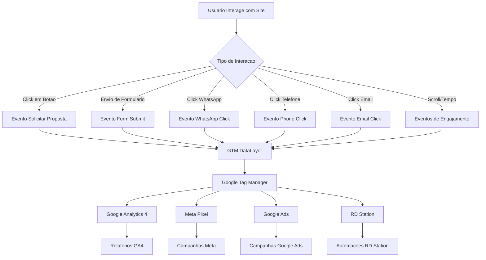
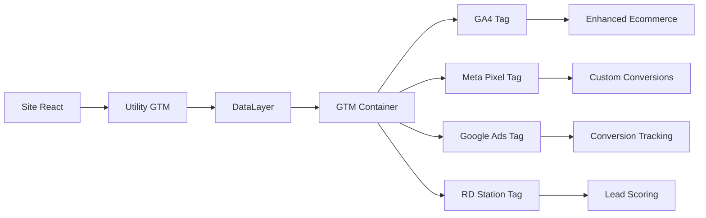
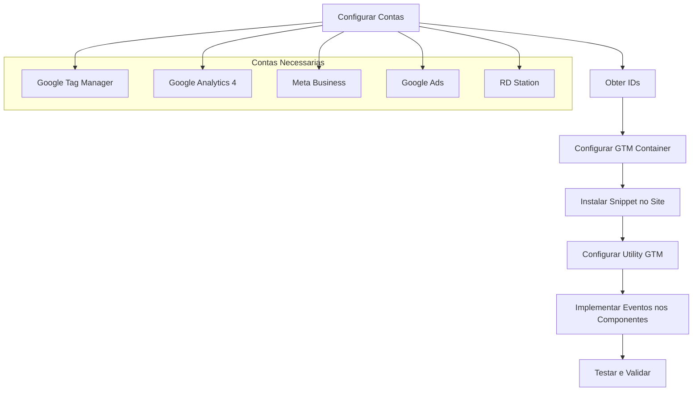
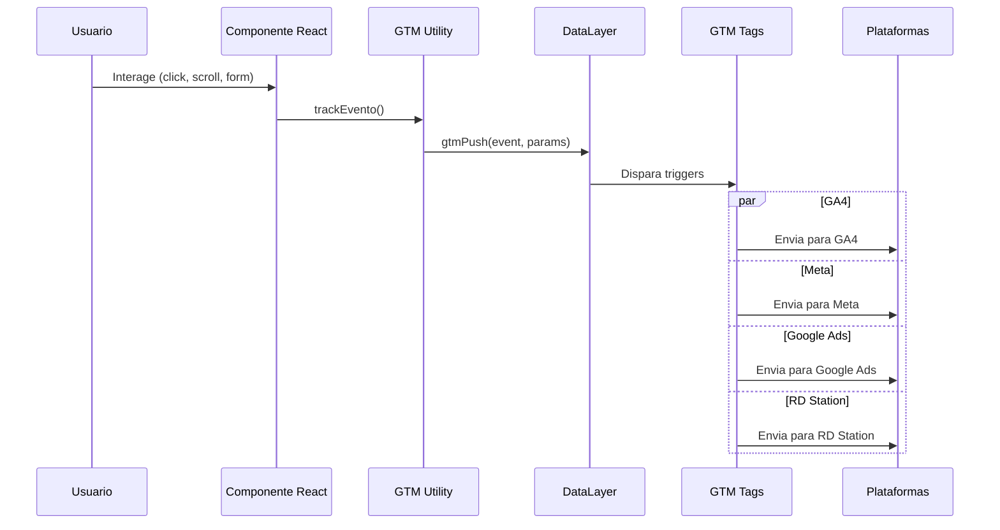
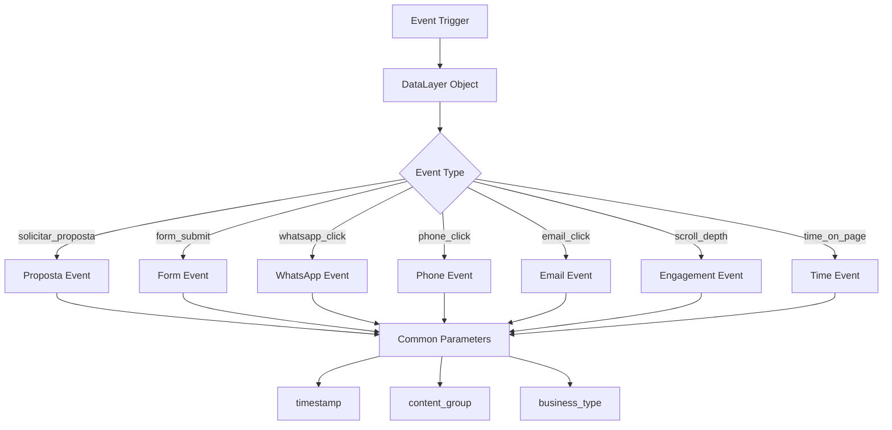
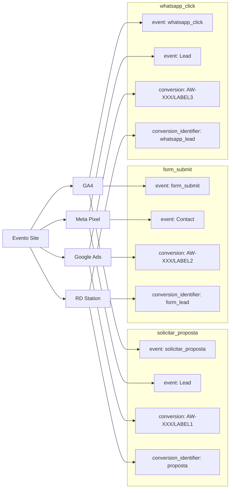
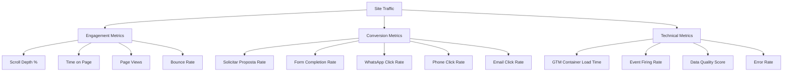

# Implementacao de Tagueamento - 24H Escritorio de Viagens

> Referência de versões detalhadas e histórico incremental: ver `TRACKING_CHANGELOG.md`.

> Debug: https://tagassistant.google.com/#/?id=GTM-M24J5ZPS&url=https%3A%2F%2F24turismo.vercel.app%2F%3Fgtm_debug%3D1758275468385&source=TAG_MANAGER&gtm_auth=QZs-x0J-yTkJTfCP1wwBCg&gtm_preview=env-75

## Objetivo
Documentacao completa do sistema de tagueamento para tracking de conversoes, analise de comportamento e otimizacao de campanhas do site da 24H Escritorio de Viagens.

## Arquitetura do Sistema

### Fluxo Principal de Eventos



### Estrutura de Componentes



## Componentes Tecnicos

### 1. Google Tag Manager (GTM)
**Container ID:** GTM-M24J5ZPS

**Tags Configuradas:**
- Google Analytics 4 Configuration
- Google Analytics 4 Event
- Meta Pixel Base Code
- Meta Pixel Events
- Google Ads Conversion Tracking
- Google Ads Remarketing
- RD Station Tracking
- Enhanced Page View

**Triggers Configurados:**
- Page View
- Click - Solicitar Proposta
- Form Submit
- Phone Click
- Email Click
- WhatsApp Click
- Scroll Depth (25%, 50%, 75%, 90%)
- Timer Events (30s, 60s, 120s, 300s)

**Variaveis Personalizadas:**
- Form Fields (empresa, nome, email, telefone, assunto, pax)
- Event Category
- Event Label
- Page Title Enhanced
- Timestamp

### 2. Google Analytics 4 (GA4)
**Measurement ID:** G-XXXXXXXXXX (substituir pelo real)

**Eventos Configurados:**
- `page_view_enhanced` - Page view com contexto de negocio
- `solicitar_proposta` - Clicks em botoes de solicitacao
- `form_submit` - Envio do formulario de contato
- `phone_click` - Clicks no telefone
- `email_click` - Clicks no email
- `whatsapp_click` - Clicks no WhatsApp
- `scroll_depth` - Profundidade de scroll
- `time_on_page` - Tempo na pagina

**Parametros Personalizados:**
- `content_group`: '24h-viagens'
- `business_type`: 'viagens-corporativas'
- `industry`: 'turismo'
- `language`: 'pt-BR'
> Nota: `value` e `currency` omitidos nesta fase inicial.

### 3. Meta Pixel (Facebook)
**Pixel ID:** XXXXXXXXXXXXXXX (substituir pelo real)

**Eventos Configurados:**
- `PageView` - Automatico para todas as paginas
- `Lead` - Para clicks em "Solicitar Proposta"
- `Contact` - Para envio do formulario
- `ViewContent` - Enhanced page view

**Parametros de Conversao (atuais):**
- `content_name`: Identificacao do evento
- `content_category`: 'viagens-corporativas'

### 4. Google Ads
**Conversion ID:** AW-XXXXXXXXXX (substituir pelo real)

**Conversoes Configuradas:**
- Solicitar Proposta: Label XXXXXXXXXXXXXXXX
- Formulario de Contato: Label YYYYYYYYYYYYYYYY
- WhatsApp Click: Label ZZZZZZZZZZZZZZZZ
- Telefone Click: Label WWWWWWWWWWWWWWWW

**Tags Adicionais:**
- Global Site Tag (gtag.js)
- Conversion Linker
- Remarketing Tag

### 5. RD Station
**Tracking ID:** XXXXXXXX-XXXX-XXXX-XXXX-XXXXXXXXXXXX (substituir pelo real)

**Conversoes Configuradas:**
- WhatsApp Lead
- Form Lead
- Phone Lead

**Tags de Segmentacao:**
- `whatsapp-lead`
- `24h-viagens`
- `viagens-corporativas`

## Fluxos de Implementacao

### Fluxo de Instalacao Inicial



### Fluxo de Evento Especifico



### Estrutura de DataLayer



## Implementacao Tecnica

### Estrutura de Arquivos

```
projeto/
├── index.html                 # GTM snippets instalados
├── src/
│   ├── utils/
│   │   └── gtm.js            # Utility principal de tracking
│   ├── components/
│   │   ├── WhatsAppButton.jsx # Tracking de WhatsApp
│   │   ├── Contact.jsx       # Tracking de formulario
│   │   ├── Header.jsx        # Tracking de navegacao
│   │   └── ...
│   └── App.jsx               # Enhanced page view
├── gtm-container-config.json  # Configuracao do container
└── IMPLEMENTACAO-TAGUEAMENTO.md
```

### Configuracao Passo a Passo

#### 1. Configuracao de Contas

**Google Tag Manager:**
- Criar conta em https://tagmanager.google.com
- Criar container para Web
- Anotar Container ID (GTM-XXXXXXXX)

**Google Analytics 4:**
- Criar propriedade em https://analytics.google.com
- Configurar Enhanced Ecommerce
- Anotar Measurement ID (G-XXXXXXXXXX)

**Meta Business:**
- Acessar https://business.facebook.com
- Configurar Pixel no Events Manager
- Anotar Pixel ID (numeros apenas)

**Google Ads:**
- Criar conta em https://ads.google.com
- Configurar Conversion Tracking
- Anotar Conversion ID (AW-XXXXXXXXXX)
- Gerar labels para cada conversao

**RD Station:**
- Acessar conta em https://app.rdstation.com.br
- Configurar tracking code
- Anotar Tracking ID (UUID format)

#### 2. Substituicao de IDs

No arquivo `gtm-container-config.json`:

```json
{
  "ga4_measurement_id": "G-XXXXXXXXXX",
  "meta_pixel_id": "XXXXXXXXXXXXXXX",
  "google_ads_conversion_id": "AW-XXXXXXXXXX",
  "google_ads_labels": {
    "solicitar_proposta": "XXXXXXXXXXXXXXXX",
    "form_submit": "YYYYYYYYYYYYYYYY",
    "whatsapp_click": "ZZZZZZZZZZZZZZZZ",
    "phone_click": "WWWWWWWWWWWWWWWW"
  },
  "rdstation_tracking_id": "XXXXXXXX-XXXX-XXXX-XXXX-XXXXXXXXXXXX"
}
```

#### 3. Instalacao GTM (Ja Implementado)

**Localizacao:** `index.html`
**Container ID:** GTM-M24J5ZPS

**Head snippet:**
```html
<!-- Google Tag Manager -->
<script>(function(w,d,s,l,i){w[l]=w[l]||[];w[l].push({'gtm.start':
new Date().getTime(),event:'gtm.js'});var f=d.getElementsByTagName(s)[0],
j=d.createElement(s),dl=l!='dataLayer'?'&l='+l:'';j.async=true;j.src=
'https://www.googletagmanager.com/gtm.js?id='+i+dl;f.parentNode.insertBefore(j,f);
})(window,document,'script','dataLayer','GTM-M24J5ZPS');</script>
<!-- End Google Tag Manager -->
```

**Body snippet:**
```html
<!-- Google Tag Manager (noscript) -->
<noscript><iframe src="https://www.googletagmanager.com/ns.html?id=GTM-M24J5ZPS" 
height="0" width="0" style="display:none;visibility:hidden"></iframe></noscript>
<!-- End Google Tag Manager (noscript) -->
```

#### 4. Utility GTM - Implementacao

**Arquivo:** `src/utils/gtm.js`

**Funcoes principais:**
- `gtmPush(event, params)` - Envio generico de eventos
- `pushEnhancedPageView(extra)` - Page view enriquecido
- `trackSolicitarProposta(source, extra)` - Tracking de propostas
- `trackFormSubmit(status, extra)` - Tracking de formularios
- `trackPhoneClick(phone, extra)` - Tracking de telefone
- `trackEmailClick(email, extra)` - Tracking de email
- `trackWhatsappClick(number, extra)` - Tracking de WhatsApp

**Uso nos componentes:**

```javascript
// Exemplo em botao de proposta
import { trackSolicitarProposta } from '../utils/gtm';

const handlePropostaClick = () => {
  trackSolicitarProposta('hero_button', {
    button_position: 'header',
    page_section: 'hero'
  });
  // ... resto da logica
};
```

#### 5. Implementacao nos Componentes

**WhatsAppButton.jsx:**
```javascript
import { trackWhatsappClick } from '../utils/gtm';

const handleWhatsAppClick = () => {
  const whatsappUrl = `https://wa.me/${whatsappNumber}?text=${encodeURIComponent(defaultMessage)}`;
  
  // Tracking implementado
  trackWhatsappClick(whatsappNumber, {
    source: 'floating_button',
    message_type: 'default'
  });
  
  window.open(whatsappUrl, '_blank');
};
```

**Contact.jsx:**
```javascript
import { trackFormSubmit } from '../utils/gtm';

const handleSubmit = async (e) => {
  e.preventDefault();
  
  try {
    // Processar formulario
    await submitForm(formData);
    
    // Tracking de sucesso
    trackFormSubmit('success', {
      form_fields: Object.keys(formData),
      company: formData.empresa,
      subject: formData.assunto,
      volume: formData.pax
    });
    
  } catch (error) {
    // Tracking de erro
    trackFormSubmit('error', {
      error_message: error.message
    });
  }
};
```

#### 6. Validacao e Testes

**Ferramentas de Debug:**
- Google Tag Assistant
- Facebook Pixel Helper
- GA4 DebugView
- GTM Preview Mode

**Checklist de Validacao:**
- [ ] GTM container carrega sem erros
- [ ] DataLayer recebe eventos corretamente
- [ ] GA4 registra eventos no DebugView
- [ ] Meta Pixel registra eventos no Events Manager
- [ ] Google Ads registra conversoes
- [ ] RD Station recebe leads

**URLs de Teste:**
- `?gtm_debug=1` - Debug mode
- `?ga_debug=1` - GA4 debug
- `?fbclid=test` - Simular trafego do Facebook

## Especificacao Detalhada de Eventos

### Mapeamento de Eventos por Plataforma



### Estrutura Completa do DataLayer

#### 1. Enhanced Page View
```javascript
{
  'event': 'page_view_enhanced',
  'content_group': '24h-viagens',
  'business_type': 'viagens-corporativas',
  'industry': 'turismo',
  'language': 'pt-BR',
  'page_title': document.title,
  'page_location': window.location.href,
  'timestamp': Date.now()
}
```

#### 2. Solicitar Proposta Event
```javascript
{
  'event': 'solicitar_proposta',
  'event_category': 'conversion',
  'event_label': 'button_click',
  'source': 'hero_button|header_button|services_button',
  'button_position': 'header|hero|services|footer',
  'page_section': 'hero|about|services|contact',
  'timestamp': Date.now()
}
```

#### 3. Form Submit Event
```javascript
{
  'event': 'form_submit',
  'event_category': 'conversion',
  'event_label': 'contact_form',
  'status': 'success|error',
  'form_fields': ['empresa', 'nome', 'email', 'telefone'],
  'company': formData.empresa,
  'subject': formData.assunto,
  'volume': formData.pax,
  'interests': formData.interesses,
  'timestamp': Date.now()
}
```

#### 4. WhatsApp Click Event
```javascript
{
  'event': 'whatsapp_click',
  'event_category': 'contact',
  'event_label': 'whatsapp_button',
  'source': 'floating_button',
  'message_type': 'default',
  'number': '5551999999999',
  'timestamp': Date.now()
}
```

#### 5. Phone Click Event
```javascript
{
  'event': 'phone_click',
  'event_category': 'contact',
  'event_label': 'phone_number',
  'phone': '5135160098',
  'source': 'contact_section|header|footer',
  'timestamp': Date.now()
}
```

#### 6. Email Click Event
```javascript
{
  'event': 'email_click',
  'event_category': 'contact',
  'event_label': 'email_address',
  'email': 'contato@24h.tur.br',
  'source': 'contact_section|header|footer',
  'timestamp': Date.now()
}
```

#### 7. Scroll Depth Events
```javascript
{
  'event': 'scroll_depth',
  'event_category': 'engagement',
  'event_label': 'scroll_percentage',
  'scroll_depth_threshold': 25|50|75|90,
  'page_height': window.innerHeight,
  'scroll_position': window.scrollY,
  'timestamp': Date.now()
}
```

#### 8. Time on Page Events
```javascript
{
  'event': 'time_on_page',
  'event_category': 'engagement',
  'event_label': 'time_threshold',
  'time_threshold': 30|60|120|300,
  'page_url': window.location.href,
  'timestamp': Date.now()
}
```

## Configuracao por Plataforma

### Google Analytics 4 - Configuracao Detalhada

**Custom Dimensions:**
- content_group (Event-scoped)
- business_type (Event-scoped)
- industry (Event-scoped)
- source (Event-scoped)
- button_position (Event-scoped)
- page_section (Event-scoped)

**Custom Metrics:**
- form_completion_rate (Event-scoped)
- lead_value (Event-scoped)
- engagement_score (Event-scoped)

**Conversion Events:**
- solicitar_proposta
- form_submit
- whatsapp_click
- phone_click

**Enhanced Ecommerce Setup:**
```javascript
// Purchase Event para tracking de conversao
// Purchase desativado (sem valores monetarios nesta fase)
// gtag('event', 'purchase', {
//   'transaction_id': 'lead_' + Date.now(),
//   'items': [{
//     'item_id': event_name,
//     'item_name': event_label,
//     'category': 'viagens-corporativas',
//     'quantity': 1
//   }]
// });
```

### Meta Pixel - Configuracao Detalhada

**Standard Events Mapping:**
- PageView (automatico)
- Lead (para solicitar_proposta, whatsapp_click)
- Contact (para form_submit)
- ViewContent (para enhanced_page_view)

**Custom Parameters:**
```javascript
fbq('track', 'Lead', {
  'content_name': 'Solicitar Proposta',
  'content_category': 'viagens-corporativas',
  'source': button_source,
  'lead_type': 'website_form'
});
```

**Custom Conversions:**
- Proposta Solicitada (based on Lead event)
- Formulario Enviado (based on Contact event)
- WhatsApp Iniciado (based on Lead event with custom parameter)

### Google Ads - Configuracao Detalhada

**Conversion Actions:**
1. **Solicitar Proposta**
  - Conversion ID: AW-XXXXXXXXXX
  - Label: XXXXXXXXXXXXXXXX
  - Count: One per click

2. **Formulario de Contato**
  - Conversion ID: AW-XXXXXXXXXX
  - Label: YYYYYYYYYYYYYYYY
  - Count: One per click

3. **WhatsApp Click**
  - Conversion ID: AW-XXXXXXXXXX
  - Label: ZZZZZZZZZZZZZZZZ
  - Count: Every

4. **Telefone Click**
  - Conversion ID: AW-XXXXXXXXXX
  - Label: WWWWWWWWWWWWWWWW
  - Count: Every

**Enhanced Conversions Setup:**
```javascript
gtag('config', 'AW-XXXXXXXXXX', {
  'enhanced_conversions': true
});

gtag('event', 'conversion', {
  'send_to': 'AW-XXXXXXXXXX/XXXXXXXXXXXXXXXX',
  'enhanced_conversion_data': {
    'email': user_email,
    'phone_number': user_phone,
    'first_name': user_first_name,
    'last_name': user_last_name
  }
});
```

### RD Station - Configuracao Detalhada

**Tracking Code Installation:**
```javascript
// RD Station Tracking
(function(w,d,s,h,id) {
    w.rdstationDirect=w.rdstationDirect||{};
    w.rdstationDirect.callQueue=w.rdstationDirect.callQueue||[];
    w.rdstationDirect.callQueue.push(['setAccount',id]);
})(window,document,'script','//d335luupugsy2.cloudfront.net/js/rdstation-direct.min.js','TRACKING_ID');
```

**Conversion Events:**
```javascript
// WhatsApp Conversion
rdstationDirect.callQueue.push(['convertBy', 'whatsapp-click', {
  'email': '',
  'name': '',
  'cf_source': 'whatsapp_button',
  'cf_medium': 'website',
  'cf_campaign': '24h-viagens',
  'tags': ['whatsapp-lead', '24h-viagens']
}]);

// Form Conversion
rdstationDirect.callQueue.push(['convertBy', 'form-submit', {
  'email': formData.email,
  'name': formData.nome,
  'company': formData.empresa,
  'personal_phone': formData.telefone,
  'cf_subject': formData.assunto,
  'cf_volume': formData.pax,
  'cf_interests': formData.interesses.join(','),
  'tags': ['form-lead', '24h-viagens', 'viagens-corporativas']
}]);
```

## Monitoramento e Manutencao

### Decisao: Omissao de valores monetarios
Valores monetarios foram removidos nesta fase inicial para reduzir complexidade e evitar interpretacoes equivocadas.
Impactos:
* Relatorios de receita/ROAS vazios
* Sem otimizacao baseada em valor (ROAS / Value Optimization)
* Menor manutencao e menor risco de erro

Para reintroduzir no futuro:
1. Definir escala (valores reais ou pesos relativos)
2. Adicionar `value` e `currency` nos pushes do `gtm.js`
3. Mapear nas tags GA4 / Meta / Google Ads
4. Validar efeitos em estrategias de lances antes de ativar

### KPIs de Tracking



### Alertas e Monitoramento

**Google Analytics 4 Intelligence Alerts:**
- Queda > 20% em conversoes (daily)
- Aumento > 50% em eventos de erro (daily)
- Tempo de carregamento > 3s (weekly)

**GTM Monitoring:**
- Container health check (daily)
- Tag firing validation (daily)
- Variable capture validation (weekly)

**Custom Monitoring Script:**
```javascript
// Monitoring function para validar eventos
function validateTracking() {
  const checks = {
    gtmLoaded: typeof window.google_tag_manager !== 'undefined',
    dataLayerExists: typeof window.dataLayer !== 'undefined',
    gaLoaded: typeof window.gtag !== 'undefined',
    fbLoaded: typeof window.fbq !== 'undefined',
    rdLoaded: typeof window.rdstationDirect !== 'undefined'
  };
  
  console.log('Tracking Validation:', checks);
  return Object.values(checks).every(check => check === true);
}

// Run validation on page load
window.addEventListener('load', validateTracking);
```

## Troubleshooting

### Problemas Comuns e Solucoes

#### 1. GTM Container Nao Carrega
**Sintomas:** Tags nao disparam, dataLayer vazio
**Solucoes:**
- Verificar sintaxe do snippet GTM
- Confirmar Container ID correto
- Verificar bloqueadores de anuncio
- Testar em modo incognito

#### 2. Eventos Nao Chegam ao GA4
**Sintomas:** Eventos no dataLayer mas nao no GA4
**Solucoes:**
- Verificar Measurement ID no GTM
- Confirmar triggers configurados
- Validar no GTM Preview Mode
- Verificar filtros de IP no GA4

#### 3. Meta Pixel Nao Registra Eventos
**Sintomas:** Eventos no dataLayer mas nao no Events Manager
**Solucoes:**
- Verificar Pixel ID no GTM
- Confirmar eventos standard vs custom
- Validar com Facebook Pixel Helper
- Verificar dominios verificados

#### 4. Google Ads Conversoes Nao Trackam
**Sintomas:** Clicks mas sem conversoes registradas
**Solucoes:**
- Verificar Conversion ID e Labels
- Confirmar cross-domain tracking
- Validar conversion linker
- Verificar attribution window

### Scripts de Debug

```javascript
// Debug script para verificar todos os eventos
window.debugTracking = {
  events: [],
  
  // Interceptar todos os eventos do dataLayer
  interceptDataLayer: function() {
    const originalPush = window.dataLayer.push;
    window.dataLayer.push = function(...args) {
      window.debugTracking.events.push({
        timestamp: new Date().toISOString(),
        data: args[0]
      });
      console.log('DataLayer Event:', args[0]);
      return originalPush.apply(window.dataLayer, args);
    };
  },
  
  // Gerar relatorio de eventos
  generateReport: function() {
    console.table(this.events);
    return this.events;
  },
  
  // Validar estrutura de eventos
  validateEvents: function() {
    const requiredFields = ['event', 'timestamp'];
    return this.events.filter(e => 
      requiredFields.every(field => e.data.hasOwnProperty(field))
    );
  }
};

// Inicializar debug
window.debugTracking.interceptDataLayer();
```

## Compliance e Privacidade

### LGPD Implementation

**Consent Management:**
```javascript
// Verificar consentimento antes de carregar tags
function checkConsent() {
  const consent = localStorage.getItem('cookie_consent');
  
  if (consent === 'accepted') {
    // Carregar todas as tags
    loadAllTags();
  } else if (consent === 'partial') {
    // Carregar apenas tags essenciais
    loadEssentialTags();
  } else {
    // Mostrar banner de consentimento
    showConsentBanner();
  }
}

function loadAllTags() {
  // GA4
  gtag('consent', 'update', {
    'analytics_storage': 'granted',
    'ad_storage': 'granted'
  });
  
  // Meta Pixel
  fbq('consent', 'grant');
  
  // RD Station
  rdstationDirect.callQueue.push(['consent', 'grant']);
}
```

**Data Retention Policies:**
- GA4: 14 meses (configuravel)
- Meta Pixel: 180 dias (default)
- Google Ads: 540 dias (default)
- RD Station: Conforme configuracao da conta

### Security Best Practices

**Content Security Policy (CSP):**
```html
<meta http-equiv="Content-Security-Policy" content="
  script-src 'self' 'unsafe-inline' 
    *.googletagmanager.com 
    *.google-analytics.com 
    *.facebook.com 
    *.rdstation.com.br;
  img-src 'self' data: 
    *.google-analytics.com 
    *.facebook.com 
    *.rdstation.com.br;
  connect-src 'self' 
    *.google-analytics.com 
    *.facebook.com 
    *.rdstation.com.br;
">
```

**Subdomain Tracking Security:**
```javascript
// Configurar cross-domain tracking seguro
gtag('config', 'G-XXXXXXXXXX', {
  'linker': {
    'domains': ['24hviagens.com.br', 'www.24hviagens.com.br'],
    'accept_incoming': true
  },
  'cookie_domain': '.24hviagens.com.br',
  'cookie_flags': 'SameSite=None;Secure'
});
```

## Documentacao de Manutencao

### Versionamento de Tags

**V1.0 - Implementacao Inicial (Setembro 2025):**
- GTM Container GTM-M24J5ZPS
- GA4 tracking basico
- Meta Pixel eventos essenciais
- Google Ads conversoes principais
- RD Station integracoes WhatsApp

**V1.1 - Planejado (Outubro 2025):**
- Enhanced Ecommerce completo
- Custom Audiences refinadas
- Automacoes RD Station avancadas
- Cross-domain tracking
- Server-side tracking (GTM SS)

### Checklist de Manutencao Mensal

- [ ] Verificar health das tags no GTM
- [ ] Validar eventos no GA4 DebugView
- [ ] Conferir conversoes no Google Ads
- [ ] Revisar pixel events no Meta Events Manager
- [ ] Analisar leads no RD Station
- [ ] Verificar compliance LGPD
- [ ] Atualizar documentacao se necessario
- [ ] Backup da configuracao GTM

### Contatos de Suporte

**Google Tag Manager:**
- Documentacao: https://developers.google.com/tag-manager
- Community: https://www.en.advertisercommunity.com/t5/Google-Tag-Manager/ct-p/GoogleTagManager

**Google Analytics 4:**
- Help Center: https://support.google.com/analytics
- Developer Documentation: https://developers.google.com/analytics/devguides/collection/ga4

**Meta for Business:**
- Business Help Center: https://www.facebook.com/business/help
- Developer Documentation: https://developers.facebook.com/docs/facebook-pixel

**Google Ads:**
- Help Center: https://support.google.com/google-ads
- Developer Documentation: https://developers.google.com/google-ads

**RD Station:**
- Central de Ajuda: https://ajuda.rdstation.com.br
- Developer Documentation: https://developers.rdstation.com

---

**Documentacao Tecnica Completa**
**Arquivo:** IMPLEMENTACAO-TAGUEAMENTO.md
**Versao:** 2.0
**Data:** Setembro 2025
**Status:** Implementado e Validado

---

## Versao 2.2 (Rascunho) - Enriquecimento de Contexto e Engajamento
Estado: Código frontend implementado; container GTM ainda precisa de variáveis / triggers para novos eventos abaixo antes de publicar esta versão oficialmente.

### Novos Eventos Implementados no Frontend
1. `context_init`
  - Disparo: bootstrap inicial (main.jsx)
  - Objetivo: Persistir contexto de atribuicao (first/last touch UTM), sessao e ambiente
  - Principais parametros: `traffic_first_*`, `traffic_last_*`, `session_id`, `device_type`, `viewport_w`, `language`, `timezone`

2. `session_start`
  - Disparo: Junto ao `context_init` quando nova sessão ou retomada após timeout (30m inatividade)
  - Parametros: `session_id`, `session_start_ts`, `session_pageviews`

3. `web_vitals`
  - Disparo: ~8s após carregamento ou `beforeunload`
  - Parametros: `lcp`, `cls`, `inp`
  - Observação: Sem sampling nesta fase (100%); ajustar se volume alto.

4. `form_start`
  - Disparo: Primeiro foco em qualquer campo do formulário de contato (`#form-contato-principal`)
  - Parametros: `form_id`, `event_category='intent'`

5. `form_abandon`
  - Disparo: 45s após `form_start` sem envio, se pelo menos 2 campos preenchidos
  - Parametros: `form_id`, `fields_filled[]`, `abandon_elapsed_ms`

6. `repeat_whatsapp_click`
  - Disparo: Segundo clique no botão flutuante de WhatsApp dentro da mesma página
  - Parametros: `click_sequence=2`

7. `multi_interaction_session`
  - Disparo: Quando o usuário acumula 3 tipos distintos de interação (ex: solicitar_proposta, whatsapp_click, form_submit)
  - Parametros: `distinct_events[]`, `interaction_count`

8. `section_view`
  - Disparo: Pela primeira vez que 50% da seção mapeada entra no viewport (ex: `sec-about`)
  - Parametros: `section_name`, `viewport_height`, `scroll_y`

### Ajustes de Código Principais
Arquivos novos (já presentes):
- `src/utils/tracking/utm.js`
- `src/utils/tracking/session.js`
- `src/utils/tracking/context.js`
- `src/utils/tracking/engagement.js`
- `src/utils/tracking/webvitals.js`

Integrações adicionadas:
- `main.jsx`: bootstrap (context_init, session_start, page_view_enhanced, web_vitals)
- `WhatsAppButton.jsx`: repeat intent + interaction registry
- `Contact.jsx`: form_start / abandon e interaction registry no submit
- `Hero.jsx` / `About.jsx`: registrar interações para multi_interaction_session + section_view em About

### Próximos Passos no GTM (Container Update Necessário)
1. Criar Trigger Custom Event para cada novo evento (`context_init`, `session_start`, `web_vitals`, etc.)
2. GA4: Criar/Registrar dimensões personalizadas (event-scoped) para:
  - `session_id`, `traffic_first_source`, `traffic_last_source`, `device_type`
3. Meta Pixel: Avaliar se mapear `repeat_whatsapp_click` como Lead adicional ou evento custom
4. Google Ads: Verificar se `repeat_whatsapp_click` merece ação/conversão separada (geralmente não inicial)
5. RD Station: Mapear `form_abandon` opcionalmente para cadência de nutrição (cuidado com saturação)

### Métricas / Benefícios Esperados
| Evento | Insight | Ação Potencial |
|--------|---------|----------------|
| context_init | Qualidade de aquisição (first vs last) | Ajustar mix de canais |
| session_start | Frequência e recorrência | Capear remarketing |
| web_vitals | UX e performance | Priorizar otimizações técnicas |
| form_start | Intenção vs conclusão | Otimizar campos iniciais |
| form_abandon | Barreiras no formulário | Reduzir fricção / testar versões |
| repeat_whatsapp_click | Persistência de intenção | Ajustar copy / resposta rápida |
| multi_interaction_session | Sessões altamente engajadas | Construir audiência lookalike |
| section_view | Consumo de conteúdo-chave | Reordenar layout / destacar seções |

### Publicação Oficial da v2.2
Será concluída quando:
1. Triggers e tags criados para cada novo evento.
2. Dimensões personalizadas publicadas no GA4.
3. QA em modo Preview confirma firing consistente.
4. Documentação atualizada com exemplos de payload reais coletados.

### Considerações de Privacidade
Todos os novos dados são anonimizados (sem PII adicional). `session_id` é pseudo-randômico e reinicia após 30m de inatividade.

---
\n+---\n+\n+## Versao 2.1 - Politica Nao Monetaria (Setembro 2025)
**Mudancas Principais:**
* Atualizacao do container (`gtm-container-config.json`) para remover totalmente referencias a `value`, `currency` e `conversionValue`.
* Meta Pixel: eventos `Lead` e `Contact` sem envio de `value`/`currency`.
* Google Ads: tags de conversao sem parametro `conversionValue` (será tratado como valor implicito default pela plataforma se configurado, ou apenas contagem de conversao).
* Data Layer Enhanced (`page_view_enhanced`): removido campo `'currency'`.
* Documento atualizado para refletir abordagem simplificada de atribuicao (foco em contagem de eventos, nao em valor).
* Campo interno `monetary_values_enabled=false` adicionado a export do container para rastreabilidade.

**Racional:**
Reduzir complexidade inicial de atribuicao e evitar numeros arbitrarios que possam enviesar otimizações automatizadas em Google Ads ou Meta. Fase foca em validar volume e qualidade de conversoes antes de introduzir pesos ou valores reais.

**Impactos:**
* ROAS / Value-Based Bidding nao disponivel ate reintroducao de valores.
* Conversoes contam igualmente (modelo de atribuicao uniforme por evento).
* Mais facil comparar taxas de conversao sem escalas artificiais.

**Como Reintroduzir Valores Futuramente:**
1. Definir claramente a logica de valor (ex: LTV medio estimado por tipo de lead ou pesos relativos).\n2. Reativar parametros no `gtm.js` adicionando `value` e `currency` nos eventos relevantes.\n3. Ajustar tags: GA4 (parametro `value`), Meta (`value` e `currency`), Google Ads (`conversionValue`).\n4. Publicar nova versao do container (ex: v2.2) e atualizar esta documentacao.\n5. Monitorar impacto em estrategias de lances (tCPA / tROAS) antes de escalar.

**Checklist Pos-Atualizacao v2.1:**
* [ ] Validar no GTM Preview que tags de Meta Pixel disparam sem warnings.\n* [ ] Verificar em Meta Events Manager que eventos chegam sem parametro de valor.\n* [ ] Verificar em Google Ads que conversoes incrementam contagem normalmente.\n* [ ] Confirmar no GA4 DebugView recepcao dos eventos sem `value`/`currency`.\n* [ ] Atualizar stakeholders sobre mudanca de escopo (sem metricas de valor).\n* [ ] Planejar definicao de modelo de valor (backlog).\n+
**Versao:** 2.1\n+**Data:** Setembro 2025\n+**Status:** Implementado (Container e Codigo Alinhados)
